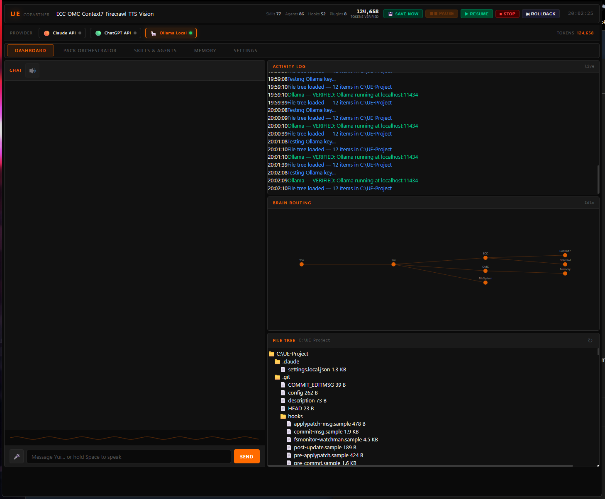
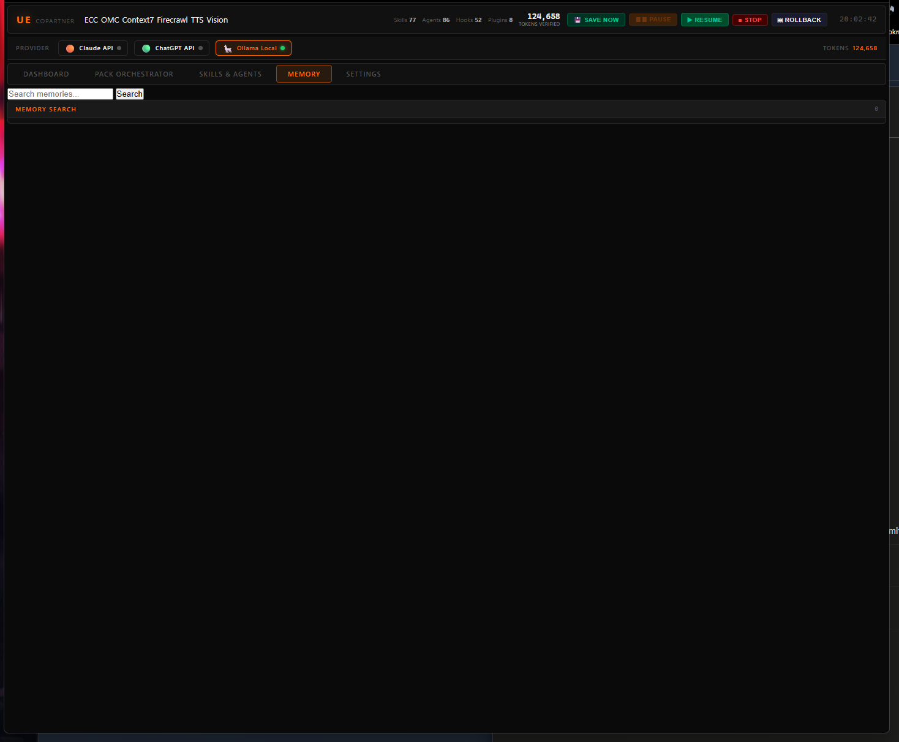
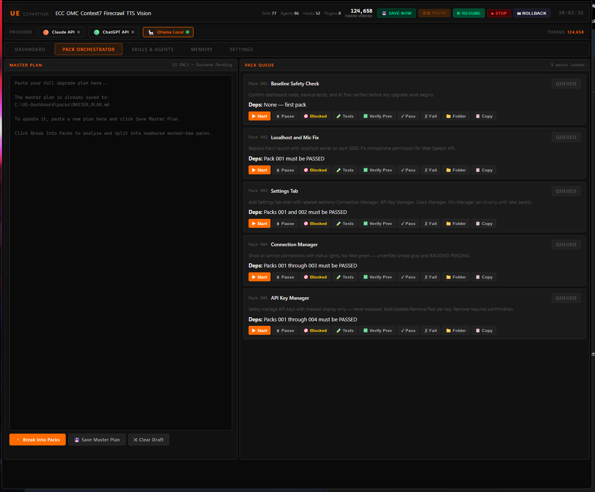
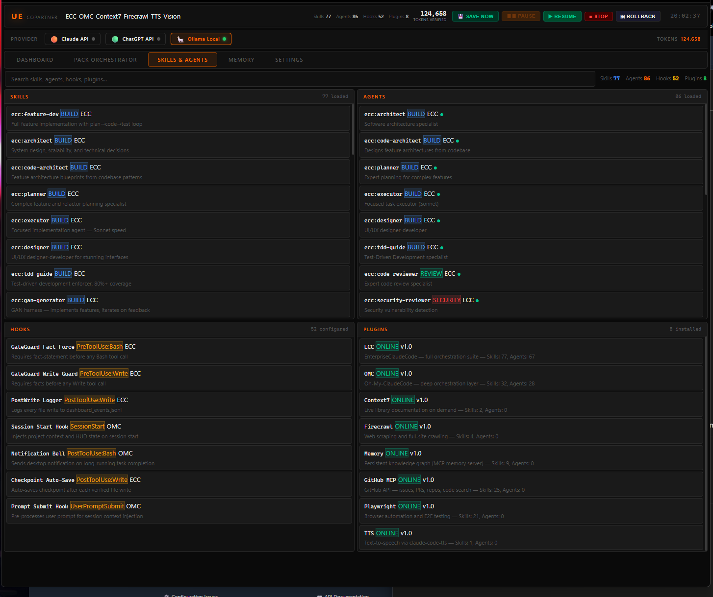
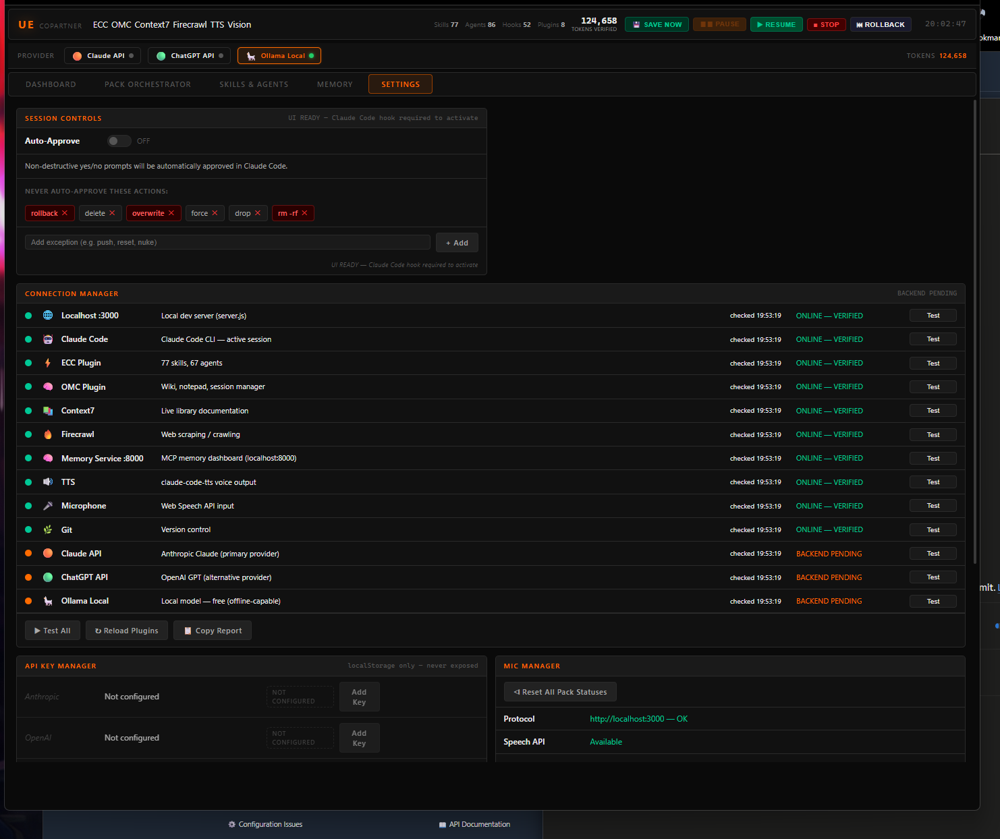
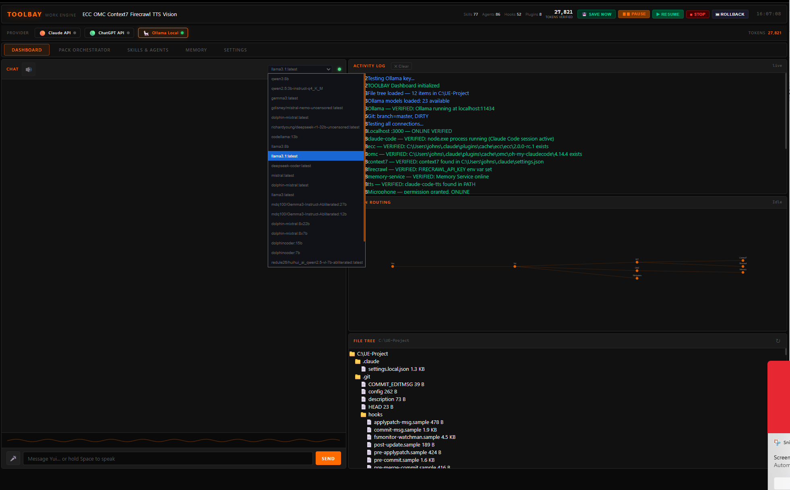
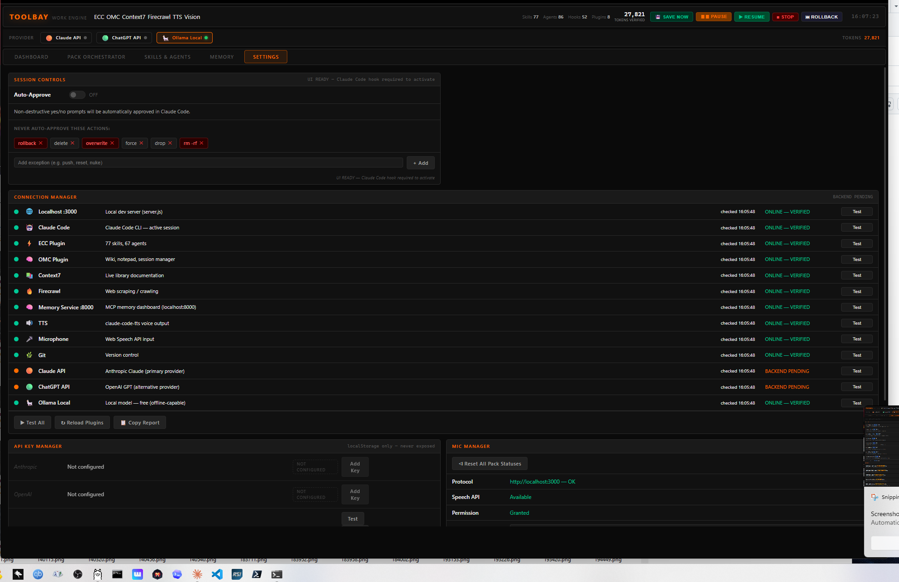
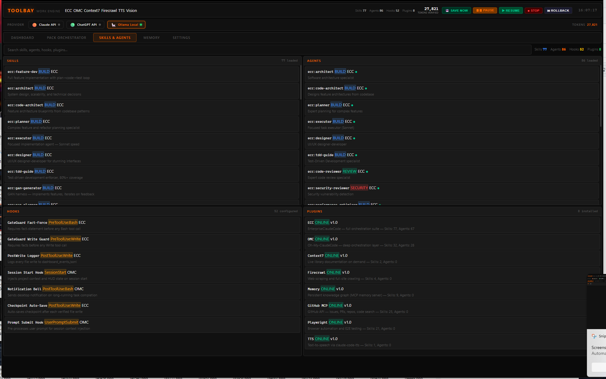

# 🛠️ TOOLBAY

**The control panel for AI work engines**

*One dashboard. Multiple AI brains. Total control.* 🧠⚡

---

## ⚡ What is TOOLBAY?

TOOLBAY is **not another AI**.

TOOLBAY is the **control dashboard for AI work engines** — a single interface for managing Claude Code, ChatGPT/OpenAI, local AI through Ollama, memory tools, plugins, and real-time project activity.

Think of it like the dashboard of a custom-built machine:

* The AI models are the engines.
* TOOLBAY is the control panel.
* The plugins are the tools.
* The memory system is the work log.
* The event bridge shows what is happening live.

---

## ✨ Current Features

* 🟠 **Claude Code bridge** — shows Claude Code events in real time
* 🟢 **OpenAI / ChatGPT support planned**
* 🦙 **Ollama local AI support** — local model use with zero cloud token cost
* 🧠 **Memory service integration**
* 🔑 **API key manager with live verification**
* 🎛️ **Multi-provider control strip**
* 📊 **Dashboard view for system status**
* 🧩 **Plugin-ready layout**
* 🛡️ **Safety and approval gate planning**
* 🧪 **Active testing while building in public**

---

## 🧠 Why TOOLBAY Exists

Most AI tools work like separate boxes.

TOOLBAY is being built to bring those boxes together into one workbench.

The goal is to let a builder control multiple AI systems from one place instead of jumping between windows, terminals, browser tabs, and disconnected tools.

TOOLBAY is being designed for:

* solo developers
* AI builders
* tinkerers
* local AI users
* Claude Code users
* people building custom AI workflows
* people who want more control over token usage

---

## 🧭 Simple Overview

🔥 TOOLBAY — AI WORK ENGINE STRUCTURE 🔥
━━━━━━━━━━━━━━━━━━━━━━━━━━━━━━━━━━━━━━━━━━━━━━━━━━

                     ┌──────────────────────────────┐
                     │        USER / BUILDER         │
                     │      Controls the work        │
                     └───────────────┬──────────────┘
                                     │
                                     ▼
┌────────────────────────────────────────────────────────────────────┐
│                              TOOLBAY                               │
│                    AI Work Engine Control Panel                    │
├────────────────────────────────────────────────────────────────────┤
│  📊 Dashboard                                                       │
│  📦 Pack Orchestrator                                               │
│  🔌 Claude Code Bridge                                              │
│  🤖 ChatGPT / OpenAI Bridge                                         │
│  🏠 Local Ollama Model Control                                      │
│  🧠 Memory / Recall Panel                                           │
│  🔑 API Key Manager                                                 │
│  📡 Real-Time Activity Log                                          │
│  ⚙️ Settings / Routing / Status                                     │
└───────────────────────────────┬────────────────────────────────────┘
                                │
                                ▼
                  ┌────────────────────────────┐
                  │      TOOLBAY ROUTER         │
                  │  Sends the right job to     │
                  │  the right AI/tool engine   │
                  └─────────────┬──────────────┘
                                │
        ┌───────────────────────┼───────────────────────┐
        │                       │                       │
        ▼                       ▼                       ▼
┌─────────────────┐   ┌─────────────────┐   ┌─────────────────┐
│   CLAUDE CODE   │   │  CHATGPT /      │   │   LOCAL AI      │
│                 │   │  OPENAI         │   │   OLLAMA        │
├─────────────────┤   ├─────────────────┤   ├─────────────────┤
│ Coding engine   │   │ Cloud AI brain  │   │ Offline/local   │
│ Project edits   │   │ Planning        │   │ Cheaper tasks   │
│ Terminal work   │   │ Writing         │   │ Quick answers   │
│ MCP tools live  │   │ Reasoning       │   │ Fallback brain  │
└────────┬────────┘   └────────┬────────┘   └────────┬────────┘
         │                     │                     │
         └──────────────┬──────┴──────────────┬──────┘
                        │                     │
                        ▼                     ▼
        ┌──────────────────────────┐   ┌──────────────────────────┐
        │      SHARED MEMORY        │   │      PROJECT CONTEXT      │
        ├──────────────────────────┤   ├──────────────────────────┤
        │ Short-term memory         │   │ Current project files      │
        │ Long-term memory          │   │ Logs / events              │
        │ Search / recall           │   │ GitHub repo info           │
        │ Learning notes            │   │ Activity history           │
        └─────────────┬────────────┘   └─────────────┬────────────┘
                      │                              │
                      └──────────────┬───────────────┘
                                     │
                                     ▼
┌────────────────────────────────────────────────────────────────────┐
│                    LIVE MCP / TOOL CONNECTION LAYER                 │
│              Currently visible through Claude Code / MCP            │
├────────────────────────────────────────────────────────────────────┤
│  ✅ GitNexus                         — 13 tools                     │
│  ✅ Memory Service                   — 7 tools                      │
│  ✅ ECC Context7                     — 2 tools                      │
│  ✅ ECC Exa                          — 2 tools                      │
│  ✅ ECC GitHub                       — 26 tools                     │
│  ✅ ECC Memory                       — 9 tools                      │
│  ✅ ECC Playwright                   — 21 tools                     │
│  ✅ ECC Sequential Thinking          — 1 tool                       │
│  ✅ Oh My Claude Code                — 49 tools                     │
├────────────────────────────────────────────────────────────────────┤
│  TOTAL LIVE SNAPSHOT:                                               │
│  • 13 MCP server entries detected                                   │
│  • 9 active connected MCP servers                                   │
│  • 130 active MCP tools available                                   │
│  • 4 services waiting on authentication                             │
└────────────────────────────────────────────────────────────────────┘
                         │
                         ▼
┌────────────────────────────────────────────────────────────────────┐
│                  WAITING ON AUTHENTICATION                         │
├────────────────────────────────────────────────────────────────────┤
│  ⚠️ Gmail                                                          │
│  ⚠️ Google Drive                                                   │
│  ⚠️ Linear                                                         │
│  ⚠️ Notion                                                         │
└────────────────────────────────────────────────────────────────────┘

━━━━━━━━━━━━━━━━━━━━━━
✅ SIMPLE VERSION OF WHAT THIS MEANS
━━━━━━━━━━━━━━━━━━━━━━

TOOLBAY should not be drawn like everything is separate and isolated.

The better idea is:

Claude Code ┐
ChatGPT     ├──► TOOLBAY ROUTER ──► Memory / Tools / Files / Logs
Ollama      ┘

Or even cleaner:

                 ┌──────────────┐
                 │   TOOLBAY    │
                 │ Control Hub  │
                 └──────┬───────┘
                        │
        ┌───────────────┼───────────────┐
        ▼               ▼               ▼
   Claude Code      ChatGPT/OpenAI    Ollama
        │               │               │
        └───────────────┼───────────────┘
                        ▼
            Shared Memory + MCP Tools

━━━━━━━━━━━━━━━━━━━━━━
🧠 TRUTH CHECK
━━━━━━━━━━━━━━━━━━━━━━

---

## 🛠️ Project Status

🚧 **Active development** — built solo, in public.

### Shipped so far

* ✅ Memory service integration
* ✅ Multi-provider control strip
* ✅ API key manager
* ✅ Live API verification
* ✅ Ollama/local AI support path
* ✅ Real-time Claude Code event bridge
* ✅ Model picker with status indicators
* ✅ Dashboard foundation

### Coming next

* 🔲 Setup wizard for first-time users
* 🔲 Standalone installer
* 🔲 Better command channel for Claude Code
* 🔲 Bidirectional approval prompts
* 🔲 More plugin integrations
* 🔲 Cleaner public showcase screenshots

---

## 📸 Screenshots

### Dashboard

### Memory

### Pack Orchestrator

### Skills & Agents

### Settings

---

## 🆕 Latest Update Screenshots

These screenshots show the newest TOOLBAY work-engine updates: local model selection, live activity logging, connection status checks, API/plugin verification, and the expanded Skills & Agents system.

### Dashboard — Local Model Picker + Live Activity Log

### Settings — Connection Manager + API/Mic Status

### Skills & Agents — Live Skills, Hooks, Agents, and Plugins

---

## 🚀 Coming Soon

A simple installer is planned so TOOLBAY can be easier to set up without manually wiring every tool.

The long-term goal is a full AI workbench where local AI, cloud AI, memory, plugins, testing, and project automation can all work together from one clean control panel.

---

## 🧱 Built By

Built solo, in public, by a hands-on builder learning and shipping one piece at a time.

**#AI #LocalAI #DevTools #ClaudeCode #Ollama #BuildInPublic #IndieBuilder**

---

© 2026 · TOOLBAY is a personal project in active development · All rights reserved
